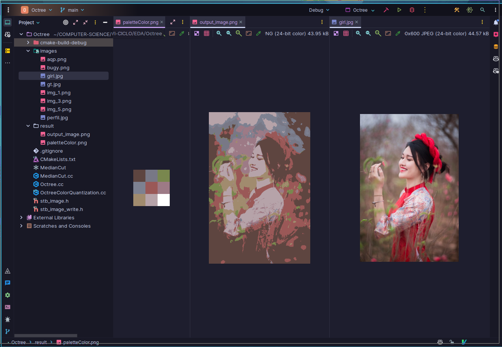

# Octree
This is a implementation of Octree, there are two implementation:
- **Octree.cc**: 
    Is a implementation data structure
- **OctreeColorQuantization**:
    Aplication of Octree for reduce colors

 ### How to compile
Use *Cmake* for compile this project
